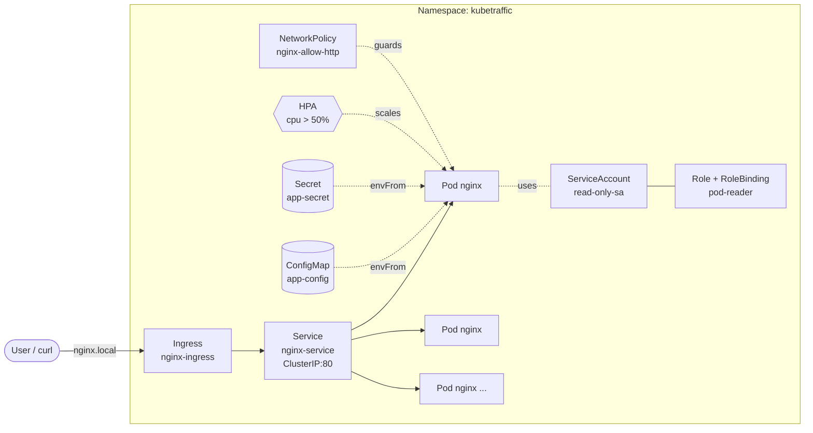

# KubeTraffic — Kubernetes Traffic Simulation & Observability Demo

A compact, production-shaped Kubernetes demo that shows how a real workload is
deployed, configured, secured, scaled, and self-healed — all from one folder.

> Single command up, single command down. Built for live walkthroughs.

---

## Architecture



---

## What's in the box

| Concern         | Resource                                          |
| --------------- | ------------------------------------------------- |
| Isolation       | `Namespace` (`kubetraffic`)                       |
| Workload        | `Deployment` (rolling updates, probes, limits)    |
| Networking      | `Service` (ClusterIP) + `Ingress`                 |
| Configuration   | `ConfigMap` + `Secret` (consumed via `envFrom`)   |
| Scaling         | `HorizontalPodAutoscaler` (CPU 50%, 2–5 replicas) |
| Identity        | `ServiceAccount`                                  |
| Authorization   | `Role` + `RoleBinding` (read-only pods)           |
| Network defense | `NetworkPolicy`                                   |
| Load            | `Job` `load-generator` (drives HPA)               |

---

## Prerequisites

- A running cluster (Docker Desktop, kind, minikube, or AKS/EKS/GKE)
- `kubectl` ≥ 1.27
- `metrics-server` installed (required for the HPA demo)
  - minikube: `minikube addons enable metrics-server`
  - kind / Docker Desktop: install the manifest from the
    [metrics-server repo](https://github.com/kubernetes-sigs/metrics-server)
- An Ingress controller if you want to hit `nginx.local` (optional)

---

## Quickstart

```powershell
# Deploy everything (kustomize)
pwsh .\scripts\demo.ps1
# or:
kubectl apply -k .

# Alternative: Helm
helm upgrade --install kubetraffic .\helm\kubetraffic
```

Verify:

```powershell
kubectl -n kubetraffic get deploy,svc,hpa,ingress,netpol,sa
kubectl -n kubetraffic port-forward svc/nginx-service 8080:80
# open http://localhost:8080
```

Tear down:

```powershell
pwsh .\scripts\cleanup.ps1
# or: kubectl delete -k .
```

---

## Demo script (5 minutes)

### 1. Show the topology
```powershell
kubectl -n kubetraffic get all
kubectl -n kubetraffic describe deploy nginx-deployment
```
Point out: probes, resource limits, envFrom (ConfigMap + Secret), ServiceAccount.

### 2. Configuration & secrets are wired in
```powershell
kubectl -n kubetraffic exec deploy/nginx-deployment -- env | Select-String "ENV|LOG_LEVEL|PASSWORD"
```

### 3. Self-healing
```powershell
kubectl -n kubetraffic get pods
kubectl -n kubetraffic delete pod -l app=nginx --wait=$false
kubectl -n kubetraffic get pods -w   # new pod appears immediately
```

### 4. Autoscaling under load
```powershell
kubectl apply -f .\manifests\load-generator.yml
kubectl -n kubetraffic get hpa nginx-hpa -w
kubectl -n kubetraffic get pods -w   # replicas grow up to 5
```
After the load Job finishes, pods scale back down (default cool-down ~5 min).

### 5. RBAC sanity check
```powershell
# Allowed
kubectl -n kubetraffic auth can-i list pods --as=system:serviceaccount:kubetraffic:read-only-sa
# Denied
kubectl -n kubetraffic auth can-i delete pods --as=system:serviceaccount:kubetraffic:read-only-sa
```

### 6. NetworkPolicy
```powershell
kubectl -n kubetraffic describe netpol nginx-allow-http
```
> NetworkPolicy is enforced only if your CNI supports it (Calico, Cilium, etc.).
> Docker Desktop's default CNI does **not** enforce it — call this out in the demo.

---

## Repository layout

```
.
├── kustomization.yml          # Single entry point for `kubectl apply -k .`
├── Dockerfile                 # Optional branded image
├── config/
│   ├── configmap.yml
│   ├── secret.yml
│   └── nginx-content.yml      # Branded landing page (mounted into nginx)
├── manifests/
│   ├── namespace.yml
│   ├── deployment.yml
│   ├── service.yml
│   ├── hpa.yml
│   ├── ingress.yml
│   └── load-generator.yml
├── security/
│   ├── serviceaccount.yml
│   ├── role.yml
│   ├── rolebinding.yml
│   └── networkpolicy.yml
├── helm/kubetraffic/          # Parameterized Helm chart (alternative to kustomize)
├── observability/             # Prometheus + Grafana setup guide
├── scripts/
│   ├── demo.ps1               # One-shot deploy + next-steps cheat sheet
│   └── cleanup.ps1            # One-shot teardown
└── .github/workflows/lint.yml # CI: kubeconform + helm lint
```

## Helm

```powershell
helm lint .\helm\kubetraffic
helm template kubetraffic .\helm\kubetraffic | kubectl apply -f -
# or
helm upgrade --install kubetraffic .\helm\kubetraffic `
  --set replicaCount=3 `
  --set ingress.host=demo.local
```

## Observability

See [observability/README.md](observability/README.md) for installing
kube-prometheus-stack and enabling the nginx exporter sidecar + ServiceMonitor
(`--set metrics.enabled=true --set metrics.serviceMonitor.enabled=true`).

## CI

Every push runs [.github/workflows/lint.yml](.github/workflows/lint.yml) which
validates raw manifests **and** the rendered Helm chart with `kubeconform`.

---

## Notes & caveats

- `app-secret` ships with a placeholder value (`12345`, base64-encoded) for demo
  purposes only. **Never commit real secrets** — use Sealed Secrets, SOPS, or an
  external secret store in production.
- The Ingress host `nginx.local` must resolve to your ingress controller's IP.
  Add it to your `hosts` file or use `kubectl port-forward` instead.
- The HPA requires `metrics-server`. Without it, `kubectl get hpa` shows
  `<unknown>` for the current CPU.

